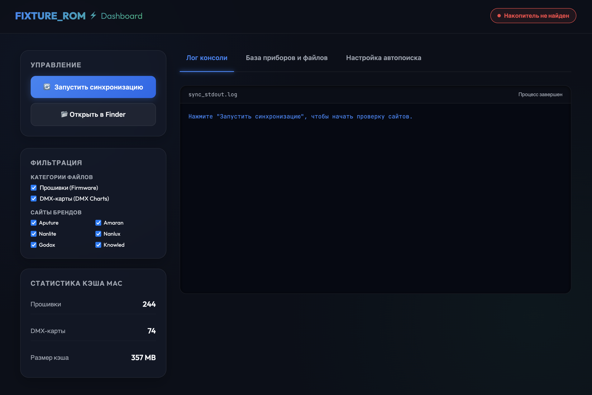
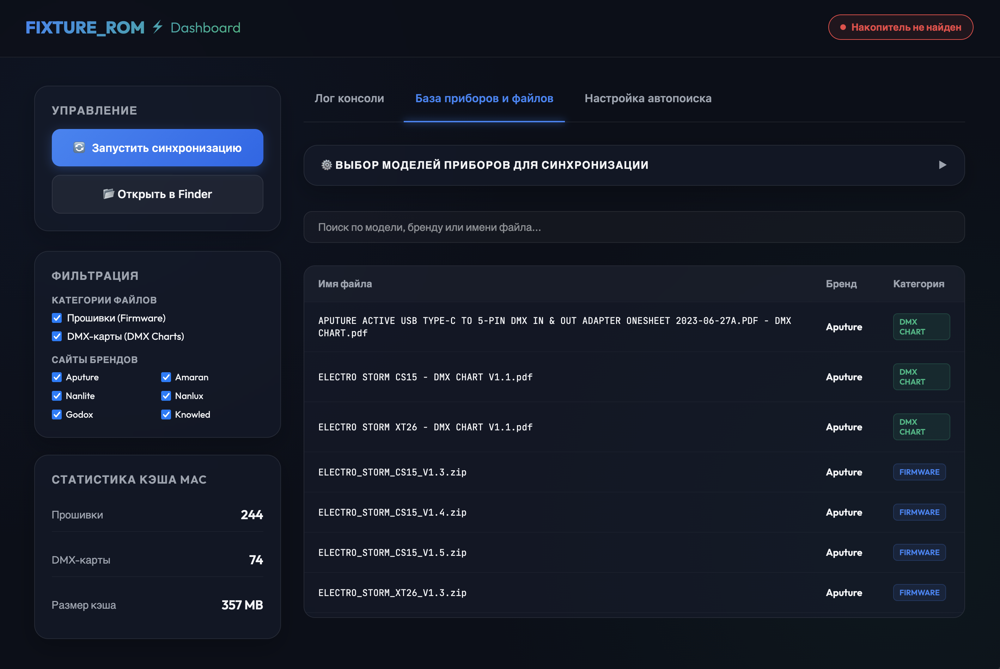

# FIXTURE_ROM ⚡ Автоматическая синхронизация прошивок и DMX-карт

<p align="center">
  
  
  
</p>

Элегантное кроссплатформенное (macOS / Windows) решение для автоматизации наполнения USB-флешки прошивками и DMX-картами популярных брендов светового оборудования.

---

## 🚀 Быстрый старт

```bash
# Клонировать репозиторий
git clone https://github.com/smnnkv-code/Fixture-ROM.git
cd Fixture-ROM

# Установить зависимости
pip install -r requirements.txt

# Запустить синхронизацию (консоль)
python sync.py

# Или запустить веб-дашборд
python gui.py
```

> **Важно**: Вставьте флешку с меткой тома `FIXTURE_ROM` — скрипт найдёт её автоматически.

---

Проект автоматически сканирует официальные сайты производителей, скачивает файлы, фильтрует лишние документы, приводит названия файлов к единому профессиональному стандарту и заливает их на флешку `FIXTURE_ROM` при ее подключении.

---

## 🌟 Основные возможности

* **Живой автопоиск (Scrapers)**:
  * Автоматический сбор ссылок через API и парсинг сайтов производителей: **Aputure, Amaran, Nanlite, Nanlux, Godox, Knowled, ARRI, Astera, Creamsource, GVM, LiteGear, Lightstar, Litepanels, Quasar Science, Kino Flo, Pipe Lighting, Pheon Lux**.
  * Поддержка ручных резервных ссылок из файла `links.md`.

* **⚙️ Гибкая фильтрация (бренды, категории, модели приборов)**:
  * Возможность раздельного отключения загрузки: скачивайте только прошивки (Firmware) или только DMX-карты.
  * Управление сайтами скрапинга прямо в сайдбаре: отключайте сканирование целых брендов (например, пропустите Godox/Knowled для мгновенной проверки остальных).
  * Выбор моделей приборов: во вкладке базы приборов можно гибко отметить галочками только те модели, которые есть у вас в наличии, чтобы кэшировать файлы исключительно для них, экономя память флешки.

* **Стандарт именования "Gaffer Smart (Combined)"**:
  * **Прошивки**: `[МОДЕЛЬ_CAPS]_[ВЕРСИЯ].[расширение]` (без пробелов, через подчеркивания для максимальной совместимости с приборами). Например: `EVOKE_1200B_V1.04.02.zip`.
  * **DMX-карты**: `[МОДЕЛЬ_CAPS] - DMX CHART [ВЕРСИЯ] [ЯЗЫК].[расширение]` (человекочитаемый CAPS). Например: `ELECTRO STORM CS15 - DMX CHART V1.1.pdf`.

* **Умная фильтрация DMX и Поддержка Встроенных Карт**:
  * Скачиваются и сохраняются только PDF с ключевыми словами DMX/RDM.
  * **Godox & Knowled**: Ввиду того, что эти бренды публикуют DMX-схемы только внутри полных руководств пользователя (User Guides), реализован парсинг разделов руководств с автоматическим обходом фильтрации и помещением файлов в `02_DMX_Charts`.

* **🧹 Автоматическая очистка пустых папок**:
  * После синхронизации, фильтрации по черному списку или переименования скрипт выполняет рекурсивную очистку папки `Downloads`, удаляя пустые директории моделей и сохраняя структуру чистой.

* **Кроссплатформенный запуск**:
  * Работает на **macOS** и **Windows**.
  * Автоматическое определение флешки с именем (меткой тома) `FIXTURE_ROM` на обеих ОС.

* **Настольный веб-интерфейс (Dashboard)**:
  * Встроенная Glassmorphic Dark-панель управления в браузере (запуск в один клик через `gui.py`).
  * Просмотр логов в реальном времени, статистика кэша, поиск по базе файлов и кнопка быстрого перехода в Finder/Проводник.
  * **Интегрированная аналитика времени**: Панель рассчитывает скользящее среднее время выполнения (Rolling Average) на основе истории последних 10 запусков для фаз проверки ссылок и скачивания.

* **💾 Контроль версий структуры файлов (Snapshots)**:
  * Встроенные утилиты `snapshot.py` и `diff_engine.py` позволяют разработчику делать слепки текущей структуры файлов, анализировать изменения (v2 -> v3 и т.д.), формировать лог разницы (`diff_report.txt`), а также автоматически наполнять правила перенаправлений (`rules.json`) и черный список (`blacklist.json`).

---

## 📸 Интерфейс панели управления (Dashboard)

<p align="center">
  
</p>

<p align="center">
  
</p>

---

## 📁 Структура проекта

```text
FixtureROM/
├── sync.py              # Основной скрипт парсинга, скачивания и синхронизации
├── gui.py               # Легковесный веб-интерфейс управления (Dashboard)
├── rename.py            # Утилита для начального/ручного переименования кэша
├── snapshot.py          # Скрипт создания слепков структуры папки Downloads
├── diff_engine.py       # Скрипт дифференциального анализа слепков
├── links.md             # Ручные ссылки на приборы и архивы файлов
├── requirements.txt     # Зависимости Python
├── Snapshots/           # База слепков, правил переименования и черный список файлов
└── .gitignore           # Исключение кэша прошивок (~2 ГБ) из git-репозитория
```

Скрипт автоматически организует файлы на флешке по следующей структуре:
```text
FIXTURE_ROM/
├── 01_Firmware/         # Прошивки, разложенные по брендам
│   ├── Aputure/
│   └── Nanlite/
└── 02_DMX_Charts/       # DMX-карты, разложенные по брендам
    ├── Aputure/
    └── Nanlite/
```

---

## 💻 Пошаговая установка через терминал

Вам не нужно заходить в браузер для ручного скачивания установщиков Python или Git. Всё устанавливается в одну строку через терминальные пакетные менеджеры.

###  Инструкция для macOS

Установка выполняется через стандартный менеджер пакетов **Homebrew**. Если у вас его нет, сначала установите его.

1. **Откройте Терминал** (через Spotlight `Cmd + Space` -> написать "Terminal").
2. **Установите Homebrew** (если он еще не установлен):
   ```bash
   /bin/bash -c "$(curl -fsSL https://raw.githubusercontent.com/Homebrew/install/HEAD/install.sh)"
   ```
3. **Установите Python 3 и Git**:
   ```bash
   brew install python git
   ```
4. **Клонируйте проект и перейдите в его папку**:
   ```bash
   git clone https://github.com/smnnkv-code/Fixture-ROM.git
   cd Fixture-ROM
   ```
5. **Установите библиотеки Python**:
   ```bash
   pip3 install -r requirements.txt
   ```
6. **Запустите веб-панель управления**:
   ```bash
   python3 gui.py
   ```

---

### ❖ Инструкция для Windows (Windows 10 / 11)

Установка выполняется через встроенный менеджер пакетов Windows **Winget** (он предустановлен в системе по умолчанию).

1. **Откройте PowerShell от имени Администратора** (кликните правой кнопкой на кнопку «Пуск» -> выбрать «Терминал (Администратор)» или «PowerShell (Администратор)»).
2. **Установите Python 3.11 и Git**:
   Выполните команду (соглашайтесь со всеми лицензионными соглашениями в процессе, введя `y` или `yes` при запросе):
   ```powershell
   winget install --id Python.Python.3.11 -e && winget install --id Git.Git -e
   ```
3. **ПЕРЕЗАПУСТИТЕ PowerShell** (закройте окно и откройте его снова, чтобы обновились системные пути `PATH`).
4. **Клонируйте проект и перейдите в его папку**:
   ```powershell
   git clone https://github.com/smnnkv-code/Fixture-ROM.git
   cd Fixture-ROM
   ```
5. **Установите библиотеки Python**:
   ```powershell
   pip install -r requirements.txt
   ```
6. **Запустите веб-панель управления**:
   ```powershell
   python gui.py
   ```

---

## ⚙️ Настройка автозапуска (Автоматизация)

###  Для macOS (Sequoia и др.)

Вы можете настроить запуск синхронизации полностью автоматически без участия пользователя:

#### Вариант А: Еженедельное фоновое сканирование (каждое воскресенье в 12:00)
1. Скопируйте файл `com.fixturerom.weekly.plist` в папку `~/Library/LaunchAgents/`.
2. Зарегистрируйте его в системе:
   ```bash
   launchctl bootstrap gui/$(id -u) ~/Library/LaunchAgents/com.fixturerom.weekly.plist
   ```

#### Вариант Б: Запуск при подключении флешки
1. Скопируйте файл `com.fixturerom.sync.plist` в папку `~/Library/LaunchAgents/`.
2. Зарегистрируйте его в системе:
   ```bash
   launchctl bootstrap gui/$(id -u) ~/Library/LaunchAgents/com.fixturerom.sync.plist
   ```

*(Подробные инструкции по конфигурации LaunchAgents и AppleScript Folder Actions находятся в файле `macos_automation.md` в папке проекта).*

---

### ❖ Для Windows

#### Настройка автозапуска при подключении USB:
1. Откройте **Планировщик заданий** (Task Scheduler) в Windows.
2. Создайте новую задачу (Create Basic Task).
3. В качестве триггера выберите **При возникновении события** (When a specific event is logged):
   * Журнал: `Microsoft-Windows-NTFS/Operational`
   * Источник: `NTFS`
   * Код события (Event ID): `98` (том примонтирован и исправен).
4. В действиях (Action) укажите запуск программы:
   * Программа: `pythonw.exe` (версия python без всплывающего черного консольного окна).
   * Аргументы: `C:\Путь\К\Проекту\FixtureROM\sync.py`.

#### Настройка еженедельного сканирования:
1. В **Планировщике заданий** выберите запуск **По расписанию** (Weekly).
2. Установите удобный день и время (например, каждое воскресенье в 12:00).
3. В действии укажите запуск скрипта `sync.py`.

---

## 📄 Лицензия

MIT License

Copyright (c) 2024 smnnkv

Permission is hereby granted, free of charge, to any person obtaining a copy
of this software and associated documentation files (the "Software"), to deal
in the Software without restriction, including without limitation the rights
to use, copy, modify, merge, publish, distribute, sublicense, and/or sell
copies of the Software, and to permit persons to whom the Software is
furnished to do so, subject to the following conditions:

The above copyright notice and this permission notice shall be included in all
copies or substantial portions of the Software.

THE SOFTWARE IS PROVIDED "AS IS", WITHOUT WARRANTY OF ANY KIND, EXPRESS OR
IMPLIED, INCLUDING BUT NOT LIMITED TO THE WARRANTIES OF MERCHANTABILITY,
FITNESS FOR A PARTICULAR PURPOSE AND NONINFRINGEMENT. IN NO EVENT SHALL THE
AUTHORS OR COPYRIGHT HOLDERS BE LIABLE FOR ANY CLAIM, DAMAGES OR OTHER
LIABILITY, WHETHER IN AN ACTION OF CONTRACT, TORT OR OTHERWISE, ARISING FROM,
OUT OF OR IN CONNECTION WITH THE SOFTWARE OR THE USE OR OTHER DEALINGS IN THE
SOFTWARE.
